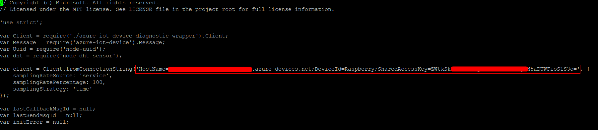

# Raspberry Pi 3 IoT End-to-End Diagnostic Demo

### What you need

1. Raspberry Pi 3 Model B board
2. An active Azure subscription. If you don't have an Azure account, [create a free Azure trial account](https://azure.microsoft.com/free/) in just a few minutes
3. A monitor, a USB keyboard, and mouse that connect to Pi
4. A Mac or a PC that is running Windows or Linux
5. A 16 GB or above microSD card
6. A USB-SD adapter or microSD card to burn the operating system image onto the microSD card
7. DHT22 temperature-humidity sensor 

### Step 1: Setup Raspberry Pi

1. Download [RASPBIAN JESSIE LITE](https://www.raspberrypi.org/downloads/raspbian/) image
2. Using [SDFormatter](https://www.sdcard.org/downloads/formatter_4/) to format your SD Card
3. Using [Etcher](https://etcher.io/) to flash the image to the SD card
4. Now that you have an operating system, you can slot your SD card into your Raspberry Pi and connect the power
5. Connet you Raspberry with monitor, keyboard, network cable, HDMI cable and mouse, and login Raspberry Pi with default user **pi**  and password  **raspberry**

### Step 2:  Connect DHT22 temperature-humidity sensor to Raspberry Pi

1. Connect the DHT22 sensor using the picture below:


2. The physical connection is like this (We use 2 5KΩ resistors instead of a 10KΩ resistors)


### Step 3: Register and obtain a device connection string from Azure IoTHub

1. If you do not have an IoTHub on Azure
+ You can refer the parts: "Create an IoT hub" and "Register device in the IoT hub for the your device" in [this article](https://docs.microsoft.com/en-us/azure/iot-hub/iot-hub-raspberry-pi-kit-node-get-started) 
+ After you have done, you will obtain your device connection string

2. If you already have an IoTHub on Azure
+ You can refer the part: "Register device in the IoT hub for the your device" in [this article](https://docs.microsoft.com/en-us/azure/iot-hub/iot-hub-raspberry-pi-kit-node-get-started) 
+ After you have done, you will obtain your device connection string

### Step 4: Download and Run IoT Diagnostic Demo

1. Setup Node Js Environment Using These Commands

```bash
curl -sL https://deb.nodesource.com/setup_6.x | sudo -E bash -
sudo apt-get install -y nodejs
```

2. Clone Diagnostic Demo from GitHub

```bash
git clone https://github.com/VSChina/raspberry-diagnostic-node-demo.git
```

3. Install Broadcom BCM 2835 C library
```bash
cd ~/raspberry-diagnostic-demo
tar zxvf bcm2835-1.50.tar.gz
cd bcm2835-1.50
./configure
make
sudo make check
sudo make install
```

4. Change Device Connection String Obtain from IoT Hub

+ Using these commands to open app.js in vim
```bash
sudo apt-get install vim
cd ..
vim app.js
```

+ Change the connection string obtained from Step 3




5. Install Node Libraries and Run the Demo 
```
npm install
node app.js
```

6. You should see messages sending to the IoTHub like below. 


